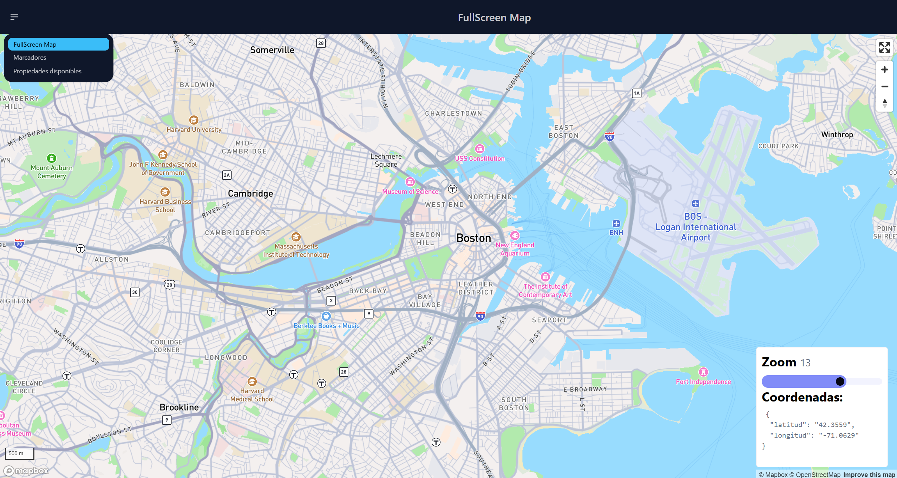

English | [Español](README.es.md)

# MapsApp

[](https://angular.dev/)
[](https://www.typescriptlang.org/)
[](https://tailwindcss.com/)
[](https://daisyui.com/)
[](https://www.mapbox.com/)



<br>

This is a **learning and practice project** built with **Angular 21** focused on integrating interactive geospatial data using **Mapbox GL**. The application demonstrates map manipulation, such as dynamic marker management, synchronized UI states, and rendering multiple map instances within a single view.

<br>

## Technical Highlights

- **Mapbox GL Integration:** Full lifecycle management of interactive maps within Angular components.
- **Reactive State with Signals:** Leveraging **Angular Signals** for high-performance UI synchronization between the map and sidebar lists.
- **Dynamic Marker Management:** Logic for creating, storing (LocalStorage), and navigating through interactive map markers.
- **Component Reusability:** Implementation of a "Mini-Map" component designed to be rendered within cards and lists without performance degradation.
- **Responsive layouts:** for map-based applications

<br>

## Tech Stack

- **Angular 21** (Signals, Standalone Components)
- **Mapbox GL JS**
- **Tailwind CSS 4.2** & **DaisyUI 5.5**
- **TypeScript**

<br>

## Installation

1. Clone the repository:

    ```bash
    git clone https://github.com/Antonio-Borrero/maps-app-angular.git
    ```

2. Install dependencies:
    ```bash
    npm install
    ```
3. Generate environment files:
    ```bash
    npm run set-envs
    ```

    - Update your Mapbox Token in `src/environments/environment.ts`.
4. Run development server:

    ```bash
    ng serve
    ```

5. Open in browser:
    - Go to `http://localhost:4200/`.
    - The app will automatically reload when any file is modified

<br>

## Project Structure

```bash
- src/
 ├── app
│   ├── maps
│   │   └── components
│   │       └── mini-map        # Reusable mini map component for rendering maps inside other views (e.g., cards)
│   ├── pages
│   │   ├── fullscreen-map-page # Fullscreen interactive map view
│   │   ├── houses-page         # Page displaying items in a card layout, each with its own map
│   │   └── markers-page        # Marker management page (list, navigation, deletion)
│   └── shared
│       └── components
│           └── navbar          # Shared navigation bar component
└── environments                # Environment configuration (API keys, settings for dev/prod)
```

<br>

## Learning outcomes

- Working with interactive maps using data from an external API
- Syncing Geographical coordinates with UI elements in real-time.
- Customizing Mapbox Markers and popups dynamically.
- Implementing responsive layouts for map-based applications

## Build

To build the production version:

```bash
ng build
```
